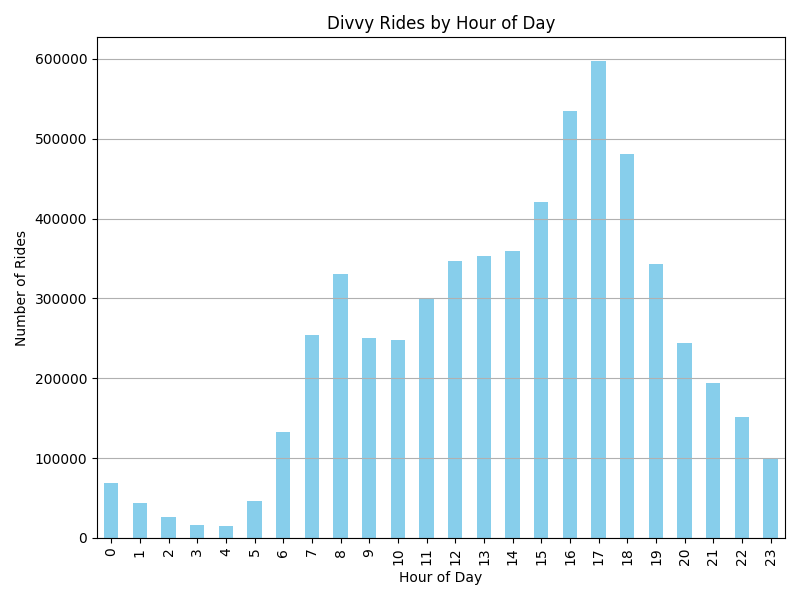
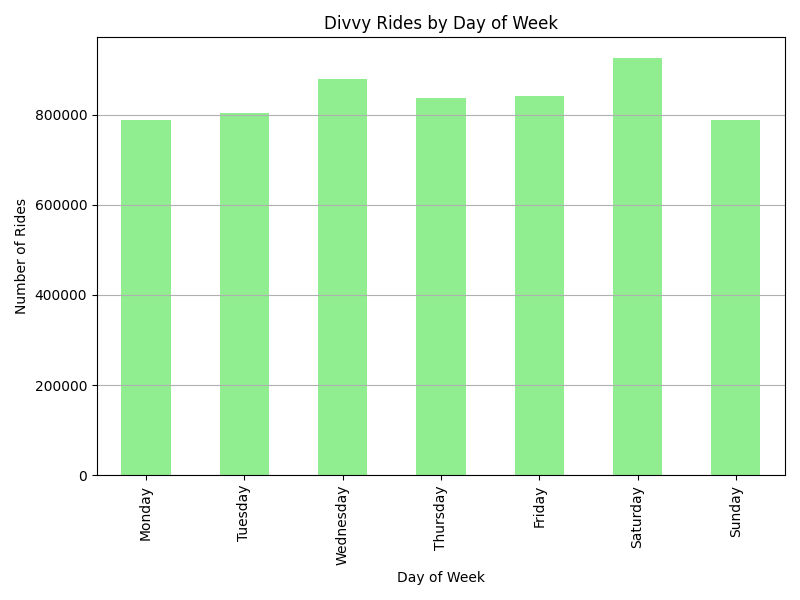
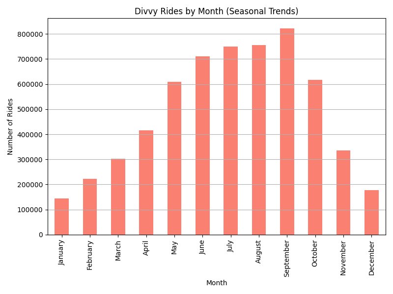
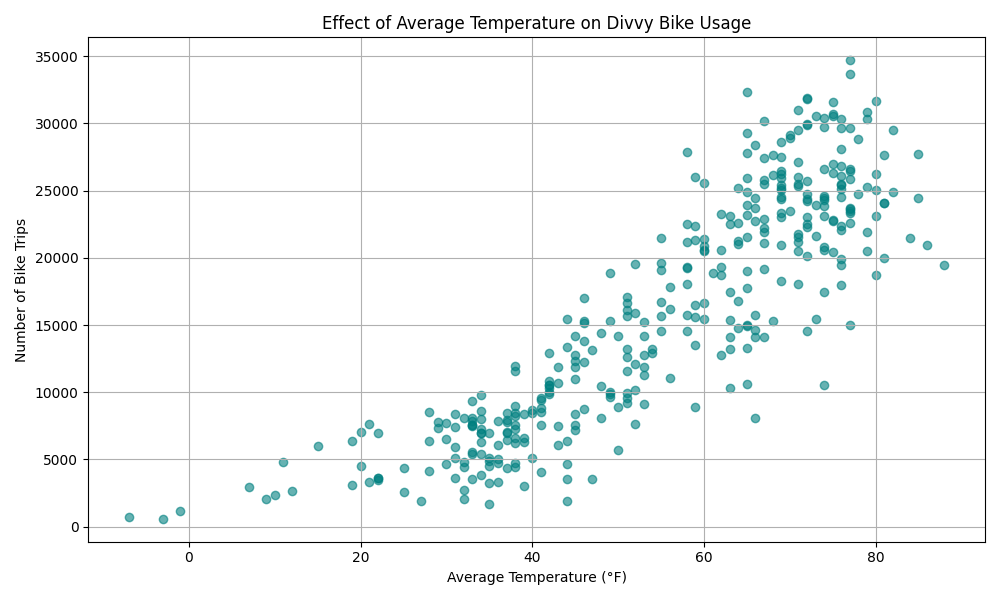
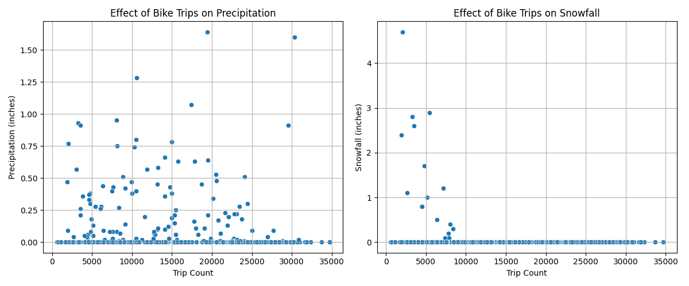
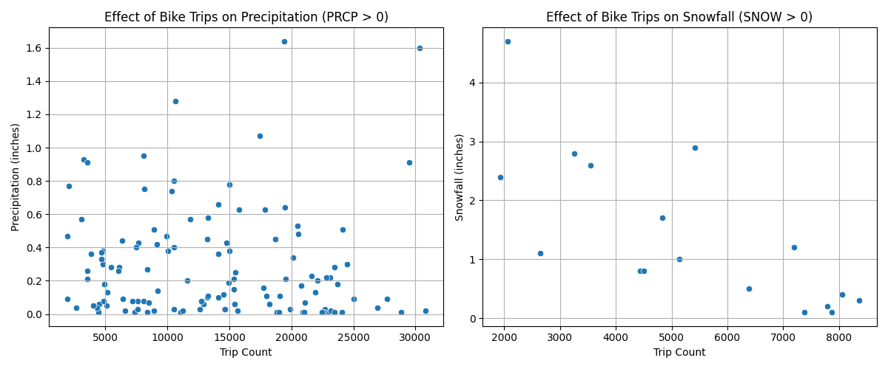

# Analyzing Weather-Driven Patterns in Chicago’s Divvy Bike Share Usage (2024)

**Link to archival record:**

**Contributors:**  
Gabriela Espinosa Arzeta, Otae Kwon

## Summary
This project analyzes public bike share usage patterns in Chicago using data from the city's Divvy bike share system. Through an analysis of environmental trends, the aim is to identify meaningful information regarding the impacts that weather patterns and time-based variables have on ridership. With the integration of Divvy trip histories and past weather data, this study is tasked with answering crucial questions of when, why, and how Chicagoans are utilizing Divvy bicycles.

The motivation behind this study stems from growing interest in green transport infrastructure in cities. Although cities keep investing in bike-sharing systems as a way of reducing emissions, alleviating congestion, and promoting healthy living, the significance of understanding how bike-sharing systems actually function remains on the rise. This study offers practical information to urban planners, transport policymakers, and mobility companies interested in maximizing the availability of services, predicting demand, and optimizing operations to cyclic or climate-driven trends.

Our research began by defining key questions:
- How does the temperature in Chicago affect Divvy bike usage?
- How do weather conditions, such as precipitation, impact the daily volume of Divvy bike rides?
- When are Divvy bikes most frequently used regarding time, day of the week, and season?

### Scripts
#### `assessment.py`
The `assessment.py` script is designed to perform comprehensive data profiling, cleaning, and integrity checks on two datasets: `combined_2024_divvy_data.csv`, which contains Divvy trip records, and `weather_2024.json`, which holds historical weather data for Chicago. The script begins by loading both datasets and then conducts data profiling that includes:
- Generating summary statistics
- Identifying missing values
- Counting duplicate rows
- Reporting the number of unique values in each column
- Displaying data types

For cleaning, it removes duplicate entries from the Divvy dataset and saves the result as `cleaned_2024_divvy_data.csv`, followed by a secondary check for duplicates to confirm the cleanup.

Additionally, the script includes an integrity verification step by computing SHA-256 hash values for both the cleaned Divvy data and the weather JSON file. These hashes are stored in `hashes/divvy.sha` and `hashes/weather.sha`, allowing users to detect any future alterations to the datasets by comparing hash values.

#### `merge_divy.py`
The `merge_divy.py` script is responsible for aggregating and preprocessing Divvy bike trip data for the year 2024. It starts by creating a `data/` directory if it does not already exist and defines a list of file paths pointing to monthly Divvy trip datasets stored in the `raw_data/` folder. It reads all twelve CSV files and combines them into a single DataFrame.

During preprocessing, the script:
- Drops irrelevant columns such as station names, IDs, coordinates, and user type
- Standardizes the datetime fields by removing fractional seconds from the `started_at` and `ended_at` columns
- Converts datetime strings into proper datetime formats
- Splits datetime values into separate `start_date`, `start_time`, `end_date`, and `end_time` columns to enhance temporal analysis

The cleaned and structured dataset is finally saved as `data/combined_2024_divvy_data.csv`. This script serves as the foundational preprocessing step for the overall project, preparing the data for subsequent analysis and visualization.

#### `visualization.py`
The `visualization.py` script is responsible for analyzing and visualizing Divvy bike usage patterns in terms of time and weather. It first extracts temporal features such as hour, weekday, and month from the cleaned Divvy dataset, and then generates bar plots showing usage patterns by hours, days of the week, and months. It blends the Divvy data with weather data to produce scatter plots showing how temperature, precipitation, and snowfall influence ride frequency. All generated visualizations are saved in the `results/` directory.

#### `weather_json.py`
The `weather_json.py` program sanitizes raw NOAA weather data stored as a CSV file (`chicago_weather.csv`). It removes columns that are irrelevant and stores the cleaned dataset in a JSON format. The resulting `weather_2024.json` file is saved in the `data/` directory to be used in later phases of the analysis pipeline.
## Data Profile

This project draws on two primary datasets to analyze the relationship between bike share activity and environmental conditions in Chicago: the **2024 Divvy Bike Share Trip Data** and **NOAA GHCND Weather Data from Chicago O'Hare**. These datasets are complementary, enabling both time-series and cross-variable analysis at a daily granularity. This section outlines the structure, sourcing, licensing, and transformation of each dataset used in the project.

### 1. 2024 Divvy Bike Share Data

The Divvy trip dataset represents daily operational data from Chicago’s official bike share system, managed by Lyft and the Chicago Department of Transportation. The data is released publicly through the City of Chicago's open data portal and includes granular trip-level records. Each month of 2024 is provided as a separate CSV file, named using the convention `2024##-divvy-tripdata.csv`.

#### Structure & Contents

Each row in the dataset corresponds to a single bike trip and includes fields such as:
- `ride_id`: a unique identifier for each ride
- `rideable_type`: the type of bike used (e.g., classic, electric)
- `started_at` and `ended_at`: full datetime stamps of the ride’s start and end times
- `start_station_name` / `end_station_name`: and associated IDs
- `start_lat`, `start_lng`, `end_lat`, `end_lng`: geographic coordinates of trip endpoints
- `member_casual`: user type (either a registered member or casual rider)

#### Data Handling

- All 12 monthly files were downloaded and stored in the `raw_data/` directory.
- These files were merged using a custom script (`merge_divvy.py`) into a single dataset: `combined_2024_divvy_data.csv`.
- During preprocessing:
  - Columns unrelated to temporal analysis (e.g., station IDs and coordinates) were dropped.
  - `started_at` and `ended_at` were split into separate date and time columns to allow daily and hourly grouping.
  - Duplicate entries and rows with missing essential fields were removed.

The cleaned dataset was saved as `cleaned_2024_divvy_data.csv`. This cleaned version supports all downstream analysis, including trip volume over time and weather-based correlations.

#### License & Access

- **License**: Creative Commons Attribution 4.0 (CC BY 4.0)
- **Update Frequency**: Monthly
- **Access Method**: Downloadable CSV files from Divvy Data Portal

The Divvy Bike Share Data provided by Lyft Bikes and Scooters, LLC ("Bikeshare") and the City of Chicago is provided under a non-exclusive, royalty-free, limited, and perpetual license for lawful purposes.

#### Permitted Uses
- Access, copy, analyze, modify, and distribute the data
- Incorporate the data into products or services
- Use the data for any lawful, non-commercial purpose, including academic research and public reports

#### Prohibited Uses
- Use the data for illegal activities
- Sell, sublicense, or host the raw dataset as a standalone product
- Use unauthorized scraping or extraction methods
- Imply affiliation or endorsement by Divvy, Lyft, or the City of Chicago
- Use any Divvy, Lyft, or City of Chicago trademarks or logos without written permission
- Attempt to identify or correlate trip data with individuals or personal data

### 2. NOAA GHCND Weather Data – Chicago O’Hare Station

The second dataset contains historical daily weather data from the NOAA Global Historical Climatology Network – Daily (GHCND) for the Chicago O’Hare weather station (Station ID: USW00094846). This dataset provides the environmental context necessary to evaluate how weather conditions affect Divvy usage.

#### Structure & Contents

The dataset includes daily readings for various meteorological variables. The fields retained in our analysis include:
- `DATE`: date of observation (YYYY-MM-DD)
- `TAVG`: average temperature (in Fahrenheit)
- `TMAX` / `TMIN`: max/min temperatures of the day (in Fahrenheit)
- `PRCP`: total daily precipitation (in inches)
- `SNOW`: snowfall total (in inches)
- `SNWD`: snow depth (in inches)

Additional columns such as wind speed and coded weather types were removed as they were either not consistently available or not relevant to our core research questions.

#### Data Handling

- Data from station USW00094846 was selected for the 2024 calendar year via NOAA Climate Data Online.
- The output format was set to Custom GHCN-Daily CSV.
- Selected data types included precipitation, average temperature, and snow depth.
- The CSV file was renamed to `chicago_weather.csv` and stored in `raw_data/`.
- Using the script `weather_json.py`, the CSV was converted to a structured JSON file (`weather_2024.json`) for better compatibility with analysis scripts.

#### License & Access

- **License**: Public Domain (U.S. Government Work)
- **Update Frequency**: Daily/Monthly
- **Access Method**: Direct download via NOAA Climate Data Portal

As a U.S. federal agency, NOAA releases its datasets as public domain resources unless otherwise specified.

#### Permitted Uses
- Access, copy, analyze, modify, and redistribute the data freely
- Incorporate the data into academic research, reports, software, and publications
- Use the data for both commercial and non-commercial purposes

#### Prohibited Uses
- There are no specific legal restrictions, but users are:
  - Encouraged not to misrepresent the data source
  - Advised to distinguish NOAA data from modifications or derived content
  - Expected to maintain scientific integrity in analysis and attribution

### Integration and Compatibility

The two datasets were integrated using `DATE` as the common key, aligning Divvy ride volumes with daily weather metrics. All preprocessing and joining were handled within Python using Pandas, and the pipeline was automated through Snakemake.

#### Validation 
- Null values were checked in both datasets
- Hash-based integrity checks were applied to detect unintended modifications
- Field types were confirmed and corrected (e.g., date strings to datetime objects)

This integration enabled the team to build visualizations and statistical comparisons showing how temperature and precipitation correlate with ride frequency.

## Findings

This analysis of the 2024 Divvy bike share data, combined with Chicago weather records, yielded several key insights into how environmental and temporal factors influence ridership. The findings align with our research questions regarding usage patterns across time, temperature, and weather conditions.

### Temporal Trends




When analyzing usage by hour of the day, we found that ridership peaks align with traditional commuting patterns. Specifically, Divvy usage shows a moderate spike between 7:00 and 9:00 AM, followed by a gradual increase beginning around 11:00 AM, reaching its highest volume between 4:00 and 6:00 PM. This trend suggests that the system is widely used by commuters for both morning and evening travel, while also supporting midday usage likely driven by errands, lunch breaks, or recreational trips. The sustained afternoon increase indicates that, beyond commuting, Divvy serves as a flexible mobility option throughout the day.


Weekly patterns showed that Wednesdays and Saturdays had the highest ridership, followed closely by Thursdays and Fridays. However, based on the graph, the number of rides appeared relatively similar across most days, with the exception of Wednesdays and Saturdays, which experienced slightly higher usage. In contrast, usage noticeably dropped on Sundays compared to the midweek peaks. This highlights a clear distinction between weekday commuting behavior and increased Saturday usage, likely driven by recreational purposes on the weekend.


Seasonal trends were clearly observed, with ridership peaking during the summer and early fall months. July and August both recorded high total trip counts, while September stood out with the highest overall usage of the year. This pattern suggests that warmer temperatures and favorable weather conditions encourage greater use of the Divvy bike share system. Following this peak, there was a noticeable drop in ridership beginning in October, likely due to cooling temperatures and the onset of less favorable weather for cycling. This seasonal decline continued into the colder months, reflecting the strong influence of seasonal weather variations on bike share usage in Chicago.

### Impact of Temperature

A scatterplot comparing average daily temperature (`TAVG`) and trip counts revealed a strong positive correlation, showing that ridership increases as temperatures rise. The relationship appeared almost exponential, with a sharp uptick in trip counts as temperatures climbed. Days with average temperatures above 60°F recorded significantly higher bike usage, while days below 40°F saw substantially lower trip volumes. This relationship underscores the importance of warm weather in promoting outdoor mobility choices like cycling and complements the seasonal trends observed, where the highest ride usage occurred from July to early September.

### Effect of Precipitation & Snowfall

The dataset also revealed a clear negative correlation between precipitation & snowfall. For a majority of the days within the 2024 year, there was no precipitation or snow, evident from the concentration of data points at the 0.00 value on the Y-axis. However, when reviewing the points that are not 0.00.


When examining the effect of snowfall on bike trips, we observe a negative correlation: as snowfall decreases, the number of Divvy rides increases, as seen on the right side of the graph. Conversely, on the left side of the graph, at exceptionally high snowfall levels, the number of Divvy trips is significantly reduced.

Surprisingly, when reviewing the precipitation data, we observed a more scattered and uniform pattern. Throughout the year, ridership remained relatively high across various levels of precipitation. Notably, even on days with heavier rainfall, the number of rides stayed substantial, as shown in the upper right-hand area of the graph. This suggests that, despite the rain, Divvy bike usage remained resilient, possibly indicating that riders were willing to use the service regardless of wet conditions.

### Summary

Overall, the analysis demonstrated that Divvy ridership in 2024 was highly influenced by temperature, precipitation, and season, with distinct peaks during warm, clear or precipitation days and typical commuting hours. These patterns provide valuable insights for bike share operations, suggesting opportunities for appropriate staffing, maintenance, and equipment utilization that respond to predictable seasonal and weather-driven fluctuations.

## Future Work

Through the process of analyzing Divvy bike share usage in relation to weather conditions, our team encountered valuable insights, not only about the data and findings but also about the challenges and opportunities inherent in working with open datasets. This section outlines key lessons learned during the project and proposes directions for future research and improvements.

### Lessons Learned

One of the most significant lessons we learned was the importance of data completeness and integration when integrating multiple datasets. A key limitation we encountered was the lack of detailed geographic data, which made it impossible to perform a reliable analysis of ride patterns by neighborhood or station, despite our initial plan to explore geographic usage trends. As a result, we pivoted to focus more heavily on temporal and environmental patterns instead. Future analyses could solve this is...

Additionally, we gained valuable experience in data profiling, quality assessment, and cleaning processes. In particular, we learned how to use hashing techniques to detect unexpected changes or alterations in the data, which helped ensure the integrity and reliability of our datasets throughout the workflow. This knowledge improved our ability to validate data and emphasized the importance of reproducibility and accountability in data analysis.

Additionally, building a reproducible data pipeline was both an achievement and a learning experience. Using Snakemake allowed us to automate data cleaning, merging, and visualization workflows. However, ensuring that the entire pipeline worked smoothly across different environments required more iteration and testing than initially expected. We learned that writing clear, modular scripts with well-documented inputs and outputs is crucial for maintainability and reproducibility.

### Potential Future Work

Building on this project, there are several directions for expanding the analysis:

- **Geographic Analysis**: If more complete station-level data becomes available, future research could investigate spatial patterns in bike usage. This could include identifying high-demand neighborhoods, mapping inequities in bike share access, or exploring the impact of bike infrastructure (e.g., proximity to bike lanes) on ridership.

- **Weather Impact Modeling**: With access to hourly weather data, future work could create predictive models estimating ridership at different times of day under varying weather conditions. This could inform operational planning, such as predicting when to rebalance bikes or schedule maintenance.

- **Integration with Other Transit Data**: Combining Divvy data with public transit usage data (e.g., CTA or Metra) could help study multimodal transportation patterns and identify opportunities for integrating bike share with the broader transit ecosystem.

Finally, future work could explore policy implications based on the findings. For instance, understanding how weather affects bike share usage could inform the city’s decisions about expanding bike infrastructure, offering promotions during off-peak seasons, or improving rider safety during adverse weather conditions.

## Reproducing

### Windows Python Alias 
Define an alias in PowerShell:
```bash
Set-Alias python3 python
```

### 1. Clone the Repository (Terminal)
```bash
git clone https://github.com/illinois-data-curation/is477-sp25-group22
cd is477-sp25-group22
```

### 2. Activate Virtual Environment (Terminal)

**(If existing base or Venv)**  
Remove Conda Base Environment:
```bash
conda deactivate
```

Remove Existing Virtual Environment:
```bash
exec zsh
```

**On Windows (PowerShell or Command Prompt):**
```bash
python -m venv venv
Set-ExecutionPolicy RemoteSigned -Scope CurrentUser #(Run Once)
venv\Scripts\activate
```

**On macOS / Linux (Terminal):**
```bash
python -m venv venv
source venv/bin/activate
```

### 3. Install Dependencies (Terminal)

Use the terminal to install all required packages & review `environment.md` file:
```bash
python3 -m pip install -r requirements.txt
```

### Gather Datasets (Terminal)
```bash
python3 download.py
```

If you run into issues during the data merging step (e.g., missing or corrupted files), you can download a preprocessed version of the combined dataset:

📁 **Instructions:**  
[Download from Google Drive](https://drive.google.com/drive/folders/1Lwwo05G5fxnasGasdScKv9SFuOeNXOaG?usp=drive_link)

Download the file(s) from the link above and place the contents into your local `is477-sp25-group22/` project folder.

### 4. Run the Workflow (Terminal)

**Special Case for Windows**  
To ensure compatibility, switch all shell commands from `python3` to `python` for proper execution on Windows systems.

Execute the Snakemake pipeline:
```bash
snakemake --cores 1
```

If you need to start fresh and remove all existing outputs:
```bash
snakemake --cores 1 --delete-all-output
```

### 5. Visualize the Workflow (Optional)

To generate a DAG (workflow graph):
```bash
python3 scripts/dag.py
```

Copy the output and paste it into [edotor.net](https://edotor.net) to view the workflow diagram or see the image in `workflow.png`.

### 6. View Results

Visualizations will be stored in the `/results` directory.

## Citations

### Dataset

- Daily Summaries Station Details: CHICAGO OHARE INTERNATIONAL AIRPORT, IL US, GHCND:USW00094846. (2025, April 5). *Climate Data Online (CDO).* https://www.ncdc.noaa.gov/cdo-web/datasets/GHCND/stations/GHCND:USW00094846/detail
- Divvy. (n.d.). *Divvy Data.* https://divvybikes.com/system-data

### Software

- **Python (Programming Language):**  
  Python Software Foundation. (2023). *Python (Version 3.x) [Computer software].* https://www.python.org

- **pandas (Data manipulation and analysis):**  
  The pandas development team. (2023). *pandas (Version X.X) [Computer software].* https://pandas.pydata.org

- **NumPy (Numerical computing):**  
  Harris, C. R., Millman, K. J., van der Walt, S. J., Gommers, R., Virtanen, P., Cournapeau, D., ... & Oliphant, T. E. (2020). Array programming with NumPy. *Nature, 585(7825),* 357–362. https://doi.org/10.1038/s41586-020-2649-2

- **Matplotlib (Data visualization):**  
  Hunter, J. D. (2007). Matplotlib: A 2D graphics environment. *Computing in Science & Engineering, 9(3),* 90–95. https://doi.org/10.1109/MCSE.2007.55

- **Seaborn (Statistical visualization):**  
  Waskom, M. L. (2021). seaborn: Statistical data visualization. *Journal of Open Source Software, 6(60),* 3021. https://doi.org/10.21105/joss.03021

- **Snakemake (Workflow automation):**  
  Mölder, F., Jablonski, K. P., Letcher, B., Hall, M. B., Tomkins-Tinch, C. H., Sochat, V., ... & Grüning, B. A. (2021). Sustainable data analysis with Snakemake. *F1000Research, 10,* 33. https://doi.org/10.12688/f1000research.29032.2

- **gdown (Google Drive file downloader):**  
  Hirai, T. (2020). *gdown (Version X.X) [Computer software].* https://github.com/wkentaro/gdown
